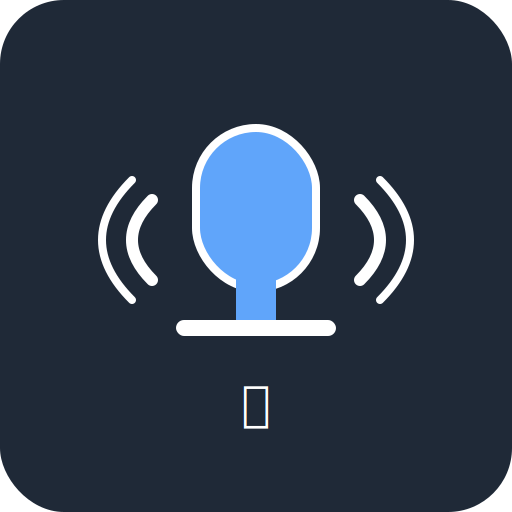

# 北京人模拟器

一个基于 React 的文本语音转换 Web 应用，支持北京话语音合成、语音识别和网页内容朗读功能。



## ✨ 功能特性

### 🎙️ 文本转语音 (TTS)
- 支持多种音色，特别推荐 Dylan 北京话音色
- 实时语音合成，支持长文本分段处理
- 音频播放控制（播放/暂停/停止）
- 支持音频文件下载

### 🗣️ 语音转文本 (STT)
- 实时语音识别，支持中文普通话
- 浏览器原生 Web Speech API
- 识别结果可直接转换为语音
- 支持文本复制和编辑

### 🌐 网页转语音
- 输入 URL 自动提取网页正文内容
- 智能内容清理和格式化
- 长文章自动分段朗读
- 支持播放进度控制

### 📱 PWA 支持
- 可安装到桌面和移动设备
- 离线缓存，部分功能可离线使用
- 响应式设计，完美适配移动端

## 🚀 技术栈

- **前端框架**: React 19 + Vite
- **样式框架**: Tailwind CSS
- **图标库**: Heroicons
- **语音合成**: Qwen TTS API
- **内容提取**: Exa API
- **语音识别**: Web Speech API
- **PWA**: Vite Plugin PWA + Workbox

## 🔧 本地开发

### 环境要求
- Node.js 18+
- npm 或 yarn

### 安装依赖
```bash
npm install
```

### 启动开发服务器
```bash
npm run dev
```

### 构建生产版本
```bash
npm run build
```

### 预览构建结果
```bash
npm run preview
```

## 🔑 API 配置

本应用需要您提供以下 API Key：

### Qwen TTS API Key
1. 访问 [阿里云灵积平台](https://help.aliyun.com/zh/dashscope/developer-reference/api-key-management)
2. 注册账号并获取 API Key
3. 在应用中点击设置按钮配置

### Exa API Key
1. 访问 [Exa AI](https://exa.ai/api/keys)
2. 注册账号并获取 API Key
3. 在应用中点击设置按钮配置

**🔒 隐私保护**: 您的 API Key 仅存储在本地浏览器中，我们不会收集或存储任何敏感信息。

## 📱 浏览器兼容性

### 桌面浏览器
- ✅ Chrome 88+
- ✅ Firefox 78+
- ✅ Safari 14+
- ✅ Edge 88+

### 移动浏览器
- ✅ Chrome Mobile 88+
- ✅ Safari iOS 14.5+
- ✅ Samsung Internet 15+

### 功能支持
- **语音合成**: 所有现代浏览器
- **语音识别**: Chrome、Edge、Safari（iOS 14.5+）
- **PWA 安装**: 所有现代浏览器

## 🎯 使用指南

### 1. 配置 API Key
首次使用需要配置 Qwen TTS 和 Exa API Key：
1. 点击右上角设置按钮
2. 输入您的 API Key
3. 点击保存

### 2. 文本转语音
1. 切换到"文本转语音"标签
2. 选择音色（推荐 Dylan 北京话）
3. 输入要转换的文本
4. 点击"生成语音"
5. 使用播放控制按钮控制音频

### 3. 语音转文本
1. 切换到"语音转文本"标签
2. 允许浏览器访问麦克风
3. 点击录音按钮开始识别
4. 清晰说话，查看实时识别结果
5. 可将识别结果转换为语音

### 4. 网页转语音
1. 切换到"网页转语音"标签
2. 输入要朗读的网页 URL
3. 点击"提取内容"
4. 预览提取的内容
5. 点击"转换为语音"开始朗读

## 📂 项目结构

```
src/
├── components/          # React 组件
│   ├── TextToSpeech.jsx     # 文本转语音组件
│   ├── SpeechToText.jsx     # 语音转文本组件
│   ├── WebToSpeech.jsx      # 网页转语音组件
│   ├── KeyConfigModal.jsx   # API Key 配置组件
│   └── AudioPlayer.jsx      # 音频播放器组件
├── api/                 # API 封装
│   ├── qwenTtsApi.js        # Qwen TTS API
│   ├── exaApi.js           # Exa API
│   └── speechApi.js        # Web Speech API
├── context/             # React Context
│   └── ApiKeyContext.jsx    # API Key 管理
├── hooks/               # 自定义 Hooks
│   └── useRecorder.js       # 录音功能 Hook
└── App.jsx              # 主应用组件
```

## 🚀 部署

### Vercel 部署
1. Fork 本项目到您的 GitHub
2. 在 [Vercel](https://vercel.com) 导入项目
3. 自动部署完成

### 其他平台
支持部署到任何静态文件托管平台：
- Netlify
- GitHub Pages
- Cloudflare Pages
- Firebase Hosting

## 🤝 贡献

欢迎提交 Issue 和 Pull Request！

### 开发指南
1. Fork 项目
2. 创建功能分支
3. 提交更改
4. 推送到分支
5. 创建 Pull Request

## 📄 许可证

MIT License

## 🙏 致谢

- [阿里云通义千问](https://tongyi.aliyun.com/) - 提供语音合成服务
- [Exa AI](https://exa.ai/) - 提供网页内容提取服务
- [Heroicons](https://heroicons.com/) - 提供精美图标
- [Tailwind CSS](https://tailwindcss.com/) - 提供样式框架

---

**🎯 让每个人都能体验纯正的北京话！**
